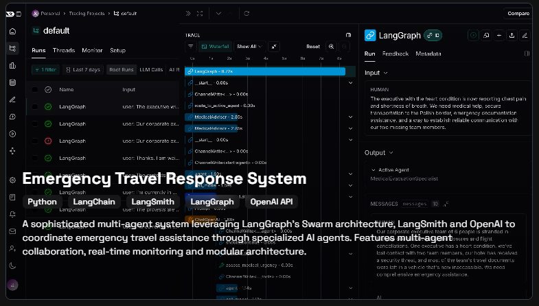

# Blog Template with Astro Shadcn UI Template

This template helps you build a blog with Astro, Tailwind CSS, and Shadcn UI.

## Getting Started

To get started with this application, make sure you have Node.js v18+ installed on your system. Then, follow these steps:

```bash
git clone --depth=1 https://github.com/AREA44/astro-shadcn-ui-template
cd astro-shadcn-ui-template
pnpm install
pnpm dev
```

Now, you can open your browser and navigate to http://localhost:4321 to see the application running.

## Features

- [Astro](https://astro.build): A modern static site builder that allows you to write components using familiar web standards like HTML, CSS, and JavaScript.
- [Tailwind CSS](https://tailwindcss.com): A utility-first CSS framework that provides a set of pre-designed styling classes to rapidly build user interfaces.
- [shadcn/ui](https://ui.shadcn.com): A collection of reusable UI components for building responsive and accessible interfaces.
- The template includes support for a theme toggle, allowing users to switch between light and dark themes.

## How to add components

Shadcn UI is a collection of re-usable components that can be easily integrated into your applications. It is not a component library, but rather a set of components that you can copy and paste into your projects.

To add a new component to your application, please refer to the [configuration guide](https://ui.shadcn.com/docs/installation/astro#thats-it).

> [!NOTE]
> In Astro, an [island](https://docs.astro.build/en/concepts/islands/) refers to any interactive UI component on the page. To add an interactive component like [Accordion](https://ui.shadcn.com/docs/components/accordion), [Dialog](https://ui.shadcn.com/docs/components/dialog) and more you have a couple of solutions available: [Add a Shadcn UI Component - Space Madness](https://spacemadness.dev/docs/add-a-shadcn-ui-component) or [shadcn-ui/ui#2890](https://github.com/AREA44/astro-shadcn-ui-template/issues/66).

For detailed documentation on using Shadcn UI, please visit the [full documentation](https://ui.shadcn.com/docs).

Shadcn UI is primarily built for the React framework. If you are unfamiliar with framework components in Astro, we recommend reading the [framework components guide](https://docs.astro.build/en/core-concepts/framework-components/) to get started.

Feel free to explore the various components and enhance your application with Shadcn UI!

## License

Licensed under the [MIT License](LICENSE).


---

# Navbar

- Home (as url of blog)
- About
- Experience
- Projects
- Blogs
- Contact

# Home

- Profile Card
- Tech I use
- Experience
- Education
- Projects
- Blogs
- Connect
===============
- Experience
- Education
- Certifications
- Testimonials
- Connect

# About me

- Biography
- Honors and Awards
- Certifications
- Voluntary work
===============
- Biography
- Resume CV / Download
- Values and Mission
- Interests Software
- What I use
  - Web Dev Setup
  - Hardware
  - Software
- Skills and Technologies
- Connect

# Projects



- top 3
- others

# Blog

- top 3
- others

# Footer


# Run docker

docker-compose up --build


## TODO
- [ ] Add imprint (legal reasons)


Generate initial favicon from here:
https://notchtools.com/initial-profile-picture-generator

and convert to svg
https://www.adobe.com/express/feature/image/convert/svg


- make tags clickable (go to projects with tag) + add number for amount of ocurrences
- change/play around with font
- change link on hover color to the major color of the logo of the experience/education
- remove bento box border
- make the profile picture longer (portrait 9:16 vertical)

https://font.download/font/tenorite
poppins
helvetica neue


